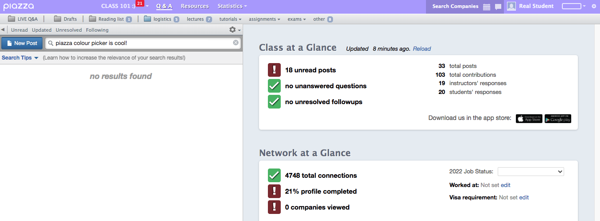
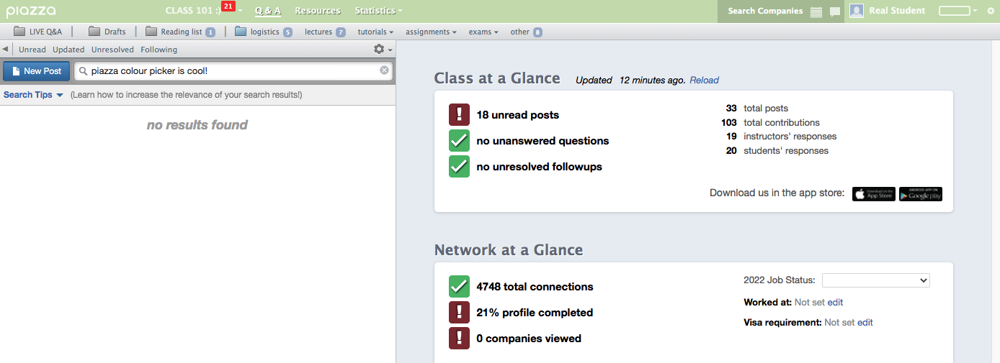
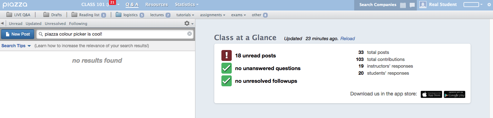
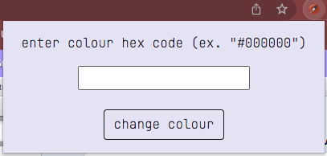

# piazza-topbar-colour-changer

nwHacks2022 @UBC w/ Alex Luo and Erin Chong

If you're a University student, chances are, you've used Piazza before, a collaborative platform to receive help from peers and instructors. However, one of the most fatal flaws would have to be the "bland" colour scheme that Piazza offers (as seen below).

This is why my team created a chrome extension called Piazza Topbar Colour Changer which allows the user to permanently change their Piazza topbar to any unique hex code/colour that the user desires!

[Chrome Extension Link Here](https://chrome.google.com/webstore/detail/piazza-topbar-colour-chan/afgdciiomggeopnojdocciillaoihnid?hl=en&fbclid=IwAR2_zuQo0Ejha4ScsWqAdQlbaVmOMXBylBZjKHLSirzUpJWsA24a3BppOgg)

# Screenshots! :)

## UPDATES POSTED BELOW

# Contributing
Our code is definitely not perfect, so if you'd like to fix/change anything with the plugin, your help is always welcome! This is an open sourced project so we highly encourage users to pick at it and improve it!

## How to locally edit
1. Fork and clone the project
2. Create a new branch: git checkout -b my-branch-name
3. Open [chrome://extensions/](chrome://extensions/ "chrome://extensions/") on your browser
4. Click Load Unpacked
5. Make your changes, verify they work.
6. Push to your fork and submit a pull request
7. Wait for your code to be reviewed.

You can email me at byronwang123919@gmail.com if you have pending changes and I'll look at it as soon as I can.
